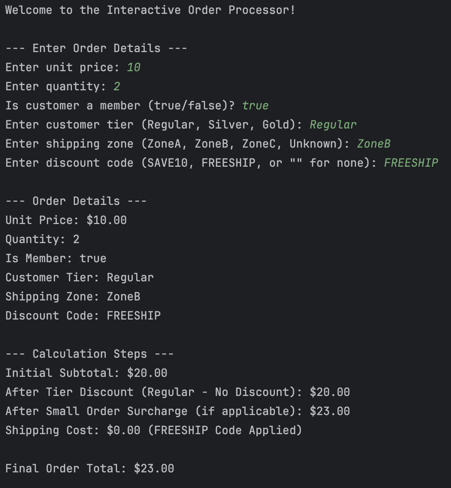

# Laboratory Activity: Using Operators and Design Construct
Submitted by: Baruc, Jana Enigma S.

## Part 1: Interactive Order Processing Logic
### Sample Output 1

### Sample Output 2

### Sample Output 3

## Part 2: Interactive String Equality
### Sample Output 1

### Sample Output 2

### Sample Output 3
